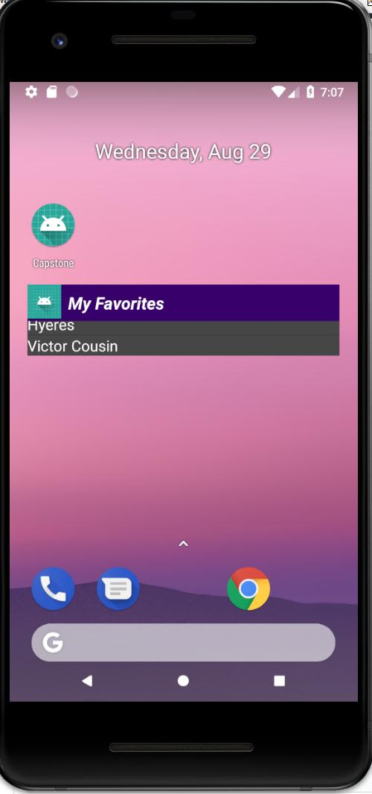

# Capstone

This is a Work in progress!

Hi, this is my Capstone project for Udacity android developer Nanodegree.
If you wan to clone the repo you will need to get you own Tisseo key and goolge Keys.
With out that the project will not compile

The project consist of an app capable of accessing the Tisseo API to give the user real time
information about public transportation schedules.

As a base, the app uses the google maps SDK.

We query the API using Retrofit to manege the calls.

The app automatically load all the nearest bus stops around the user.
If the camera is moved, this will load automatically the busstops in the visible area of the map.
If the users zooms out after certain point, the app will no longer show the bus stops.

The app also has a content provider that allows the user to save their favorite point of interest.
The user can access the favorites list via the home screen widget or the favorites activity.
In the favorites activity, the information is loaded in a RecyclerView. Swiping allows to delete the
entry.
If the user taps in a favorite entry the app will automatically load the map and go to the point of
interest.

In the main screen, the app has a search view that query the TISSEO API for suggestions.

Clicking in a point of interest will show a view with the information retrieved from the API.

App Implementation

